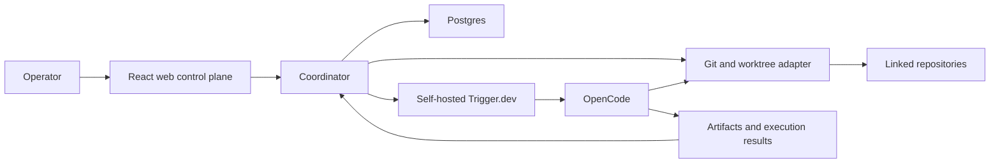

# Architecture

## Context

AgencyHQ is a modular monolith with external execution adapters. The web app is
an operator interface. The coordinator is the only component allowed to decide
what work may run, what scope it receives, how capacity is allocated, and when
evidence satisfies acceptance.

Arrows show commands or observations, not transfers of authority.

## Components

### Web control plane

Presents campaigns, project links, ranked work, allocations, approvals,
failures, and evidence. It calls coordinator application APIs and contains no
independent scheduling or acceptance logic.

### Coordinator

Owns application policy, domain transitions, scope enforcement, allocation,
approval gates, and acceptance evaluation. It persists decisions before asking
external mechanisms to act and consumes their results idempotently.
The supervisor is the engineering decision role within this boundary: it uses
context to approve the definition of done and assess results. Domain rules
validate its authority and evidence requirements. Worker agents may propose
decisions but cannot commit policy or acceptance transitions.

### Postgres

Stores the engineering/domain ledger: identities, relationships, state changes,
contracts, attempts, allocations, approvals, artifact metadata, and verification
results. Large artifact bodies may live elsewhere later, but their identity,
digest, provenance, and relationship remain in Postgres.

### Trigger.dev

Provides durable invocation, retry, scheduling, waits, and resumption. Trigger
task/run state is observed by the coordinator but never substitutes for domain
state. Trigger tasks call versioned coordinator commands and worker adapters.
Trigger remains the selected backend, subject to the first execution trial in
[TESTING.md](TESTING.md). Pin platform, SDK/CLI, and OpenCode versions together
with their compatibility evidence. As checked on 2026-09-06, [Trigger's self-hosting
overview](https://trigger.dev/docs/self-hosting/overview) lists checkpoints as
unavailable. Domain recovery must work without checkpointed process memory.
If the trial fails the recovery contract, record an ADR comparing remediation
with a Postgres-backed worker before changing backend; neither fallback nor
successful qualification is implied by these docs.

### OpenCode

Executes a StepContract in the assigned worktree using its supported provider
abstraction. AgencyHQ supplies bounded context and receives structured results;
it does not implement its own agent loop or provider adapters.

### Git and worktrees

Git is authoritative for source changes. Each mutable worker attempt receives an
isolated worktree, base revision, branch/ref policy, and allowed repository set.
Database records point to Git identities; they do not copy source truth.
The trusted Git adapter owns branch creation, snapshots, commits, shared-ref
updates, and integration. Workers edit assigned files and propose outputs.

## Enforcement boundaries

These are required adapter capabilities, not implemented guarantees. A worktree
alone is not a security or resource-isolation boundary. Dispatch must reject a
contract whose required controls cannot be provided by the configured runtime.

| Boundary | Enforcement owner and contract |
| --- | --- |
| Filesystem and repository access | Runtime isolates each attempt's writable files and prevents access to other worktrees, shared Git metadata writes, and host credentials. The Git adapter owns shared metadata mutations. |
| Fine-grained output paths | Git adapter rejects/quarantines disallowed diffs before acceptance. Path exclusions are output checks unless the runtime provides narrower write controls; contracts needing prevention must require those controls. |
| Shell, tools, network, and external effects | Runtime applies capability and egress controls before execution. Workers receive no publish/merge/deploy credentials; trusted effect adapters apply coordinator authority and reconciliation rules. A prompt instruction is not enforcement. |
| Time, concurrency, and budget | Coordinator reserves capacity; runtime enforces hard duration/process limits. Provider spend observations may lag: distinguish estimates from hard limits and reject an unsupported hard spending guarantee. Retries share the original budget. |
| Nested agents | Disabled initially. Enable only when child authority is a subset of the parent, aggregate usage is charged to its allocation, and stop/recovery controls cover all descendants. |
| Verification and acceptance | Approved criteria/profile records are outside worker write access. Verification runs without publish credentials; only the coordinator commits the supervisor's acceptance decision. |

For effects already dispatched, revocation does not imply rollback or completion.
The [replacement-worker gate](EXECUTION_MODEL.md#replacement-worker-gate) defines
what must be reconciled before another attempt can act.

## Dependency rule

Dependencies point inward: adapters depend on application/domain contracts;
domain code does not import Trigger.dev, OpenCode, React, or database clients.
Cross-component communication uses typed commands/events and stable identifiers,
not direct edits to another component's state.

## Deployment shape

Begin with one web deployment, one coordinator deployment, Postgres, and the
self-hosted Trigger.dev services it requires. Package boundaries are for clarity
and testability, not an instruction to deploy microservices.
If AgencyHQ and Trigger share a Postgres service, use separate databases and
credentials. AgencyHQ owns its migrations and uses supported Trigger APIs, never
Trigger's internal tables as an integration contract.

## Security baseline

- Keep provider and repository credentials outside prompts and artifacts.
- Grant workers repository- and operation-scoped credentials.
- Bind commands to actor, Campaign, Project, StepContract version, and attempt.
- Store immutable audit records for approvals and policy-relevant transitions.
- Treat worker output, repository content, and external callbacks as untrusted.
- Authenticate operator commands and adapter callbacks; bind them to the
  authorized actor and current attempt generation before effects or acceptance.

The domain vocabulary and relationships are detailed in
[DOMAIN_MODEL.md](DOMAIN_MODEL.md). Durable dispatch, recovery, and failure
semantics are detailed in [EXECUTION_MODEL.md](EXECUTION_MODEL.md).

See [ADR-0001](adrs/0001-authority-boundaries.md) and
[ADR-0002](adrs/0002-modular-monolith.md).
