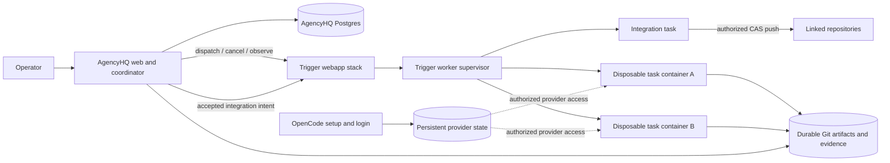

# Architecture

## Context

AgencyHQ is a modular monolith (web control plane plus coordinator) that
records intent, authority, evidence, and acceptance in Postgres and delegates
all execution to self-hosted Trigger.dev. Every unit of work — a Lead decision,
a worker attempt, a verification run, an integration — is a Trigger run. The
coordinator decides *whether* and *within what bounds* work runs and *whether
its evidence satisfies acceptance*; Trigger decides *how* it runs and *whether
it is still running*.

The accepted default is the **Compose/container runtime** in
[ADR-0008](adrs/0008-compose-first-container-runtime.md): persistent services,
OpenCode provider setup, and disposable Trigger task containers. It is
implemented for packaging, bootstrap and the task image (L1, 2026-09-09); not
yet qualified. The exercised **host profile** (`trigger dev` and host
worktrees) remains the current fallback. Component details and the host
enforcement evidence below describe current code unless marked target.

Topology (implemented on epic-14; qualification pending):




Arrows are commands and observations. Authority lives where the table in the
[README](../../README.md) says it does.

## Components

### Web control plane

React/TypeScript. Hash-router with five routes: `#/` (overview — campaigns
with main effort, projects, ranked work items with lifecycle/condition/boundary/
pending-decision count), `#/decisions` (every open `pending_human` decision
with obstacle, recommendation, impact, no-action consequence, and inline
approve/reject actions), `#/work-items/:id` (five state cards — contract,
execution, verification, acceptance, integration — plus an evidence panel and
operator actions), `#/projects/:id/authority` (JSON authority editor with
version history and confirm dialog), `#/return` (return-after-interruption
view). Work-item actions (approve, reject, stop, invalidate, pause) each show
a `ConfirmDialog` naming the action and its consequence, the project, the
work item, the attempt (when there is one), and the contract version
(`apps/web/src/control-plane-helpers.ts` `confirmMessage`, asserted by the
approve, reject, and stop journeys). The authority editor's Save button shows
a confirm naming the project, the proposed new authority version, and that
frozen contracts are unaffected.
Bearer-auth token stored in
`localStorage["agencyhq.apiToken"]`; all `/api/*` calls include
`Authorization: Bearer <token>`; a 401 response clears the token and shows a
token-entry form. For live execution state it subscribes to Trigger runs by
tag with Trigger's React hooks using scoped public access tokens. Contains no
scheduling or acceptance logic. Runs in the same Node process as the
coordinator.

**Decisions view semantics.** A `pending_human` decision is *open* when no
later decision of a resolving outcome (`approved`, `rejected`, `accepted`,
`invalidated`) closes it. Two resolution modes (implemented in
`apps/coordinator/src/views/pending.ts`, `isOpenPending`, `openPendingDecisions`):
attempt-scoped decisions (attemptId non-null) are closed by a resolving decision
with the same attemptId; plan and review decisions written without an attempt
(attemptId null) are closed by a resolving decision with the same work item, kind,
and contract version. `approval_mismatch` is not a resolving outcome, so an
`APPROVAL_VERSION_MISMATCH` response does not close the pending decision — the
entry stays visible for a corrected approve. After the operator approves or
rejects, the coordinator appends a resolving decision; the decisions view
re-filters and the entry disappears without deleting any row. The `reject` command
is state-guarded like `approve`: rejecting a decision that already has a resolving
outcome returns `state_mismatch`. `openPendingDecisions` is the sole source for
the decisions view and for the work-item page's operator action buttons.

**Decisions view fields.** Each entry exposes: `obstacle` (violation codes or
decision kind); `recommendation` (the Lead proposal's `rationale` field when
the plan observation carries one, otherwise `null` — no fallback text is
generated); `impact` (work item, contract version, attempt); `noActionConsequence`
(fixed text: `"stays pending; no dispatch"`); and available `actions`
(`approve`/`reject` for accept decisions).

### Coordinator API (Slice 6)

All routes require `Authorization: Bearer <token>`.

| Method | Path | Description |
| --- | --- | --- |
| `GET` | `/api/overview` | Campaigns with main effort, projects, ranked work items with active-attempt counts and optional skip-reason |
| `GET` | `/api/decisions` | Open `pending_human` decisions (filtered by `isOpenPending`) |
| `GET` | `/api/work-items/:id/evidence` | Full evidence for one work item |
| `GET` | `/api/work-items/:id/view` | Single-item return view including integrations and manifest rows |
| `GET` | `/api/projects/:id/authority` | Current authority and full `authority_versions` history |
| `PUT` | `/api/projects/:id/authority` | Dispatches `update_authority` command |
| `GET` | `/api/capacity` | Current `provider_capacity` rows with `effective` and `concurrency` |
| `GET` | `/api/metrics/lead` | Per-project Lead quality metrics (plans, escalation rate, acceptances, reversal rate, review yield, findings by disposition, integrations by outcome) with optional `since` query parameter |

**Slice 5–6 commands** (`POST /api/commands`, idempotent by `commandId`):

| `kind` | Effect |
| --- | --- |
| `reject` | Appends a new `rejected` decision for the same attempt (pending row kept as history — R-017); persists supplied reason in `decisions.reason`; work item lifecycle → `halted` |
| `invalidate_acceptance` | Inserts new `invalidate` decision referencing historical accept; persists supplied reason in `decisions.reason`; work item → `reopened`; historical rows untouched (R-017) |
| `create_campaign` | Creates a campaign |
| `assign_campaign` | Sets `campaign_id` on a work item |
| `set_main_effort` | Sets `main_effort_work_item_id` on a campaign; work item must belong to the campaign (`not_a_member` otherwise) |
| `set_rank` | Optimistic CAS on work item `version`; returns `stale_version` on mismatch |
| `update_authority` | Schema-validated; integer-major version must increase; `SELECT FOR UPDATE` row lock + CAS on `authority_version`; concurrent same-base update returns `version_not_increasing`; backfills initial version history on first update attributed to actor `backfill` at the project's `created_at`; appends to `authority_versions`; inserts `authority_update` decision; frozen contract bounds untouched (R-018) |
| `set_capacity` | Sets a `provider_capacity` row for a provider/model pair with a `status` (`ok`\|`limited`\|`down`) and an explicit `validUntil` timestamp; `source = "operator"`. Reflected immediately in `selectDispatch` capacity gating and in `/api/capacity`. |

### Coordinator

Owns the ledger and the policy:

- validates every transition against domain invariants and the project's
  [delegated-authority schema](adrs/0006-lead-role-and-delegated-authority.md);
- records a DispatchIntent before triggering any task and uses the intent id
  as the Trigger idempotency key;
- consumes run outputs and final statuses idempotently into attempt reports,
  Artifacts, VerificationResults, Reviews, and failure records;
- commits Lead proposals as Decisions only when they pass the authority check;
- holds the Trigger secret key and AgencyHQ's own secrets;
- on admission records the worker intent as `queued` and `BoundedRepairFlow.onLeadPlanOutput` calls `scheduleQueuedIntents` (`apps/coordinator/src/flow/schedule.ts`) directly, applying every gate at admission time; if the admitted item's own worker dispatch fails, a failure row and `pending_human` decision are recorded and the worker intent is marked `failed`; failures of other queued items during the pass are logged and those items are retried on the next poll;
- the reconciler's polling wrapper (`Reconciler.scheduleOnce`) also calls `scheduleQueuedIntents` on every polling pass: `selectDispatch` selects the highest-ranked eligible work items up to `AGENCYHQ_WORKER_SLOTS`, deducting active attempts (attempts in `stopping` status or with an in-flight `worker.attempt` intent, whose work item is not halted/completed/done — `listActiveAttemptsForScheduling`) and applying provider capacity gating before the slot gate; the provider gate is skipped entirely when the `provider_capacity` table is empty;
- when `AGENCYHQ_REALTIME_WAKEUP=true`, subscribes to `runs.subscribeToRunsWithTag`
  for the tags of all non-terminal work items; the subscription refreshes after every
  poll and resubscribes when the tag set changes (observed 2026-09-08, `@trigger.dev/sdk` 4.5.16:
  `subscribeToRunsWithTag` replays current run states on subscribe — absorbed by the
  pollOnce in-flight guard); polling remains the authoritative observation path.

### Lead

The engineering decision role (ADR-0006): OpenCode sessions in a read-only
agent configuration returning structured JSON, run as Trigger tasks in a
read-only worktree at the relevant revision. Proposes definitions of done,
verification profiles, review depth, boundaries, Finding dispositions, failure
classifications, review findings, and acceptance. Proposals become Decisions
only through the coordinator.

**Mechanism (Slice 3, 2026-09-07).** Lead tasks (`lead.plan`, `lead.review`, `lead.accept`) use the OpenCode SDK: `opencode serve --port 0` is spawned with a read-only permission ruleset, a single prompt is sent with `format: { type: "json_schema" }`, and the `StructuredOutput` tool is allowed so the JSON loop completes. The structured output is validated by `LeadPlanOutputSchema` / `ReviewOutput` / `AcceptanceProposal` before the coordinator records any Decision. The project's **verification profile catalog is an authority ceiling**: the Lead may only choose a `profileId` that appears in the project's catalog; a proposal naming an unknown profile is recorded as `pending_human` with `PROFILE_NOT_IN_CATALOG` and is not retried automatically. This was observed in the Slice 3 trial; see [trials/2026-09-slice3.md](trials/2026-09-slice3.md).

### Trigger.dev (execution runtime)

Self-hosted v4 webapp stack (ADR-0005) plus, on the host profile, `trigger dev`
running on the OpenCode host. Provides queues and per-repository
serialization, attempts and retries, `maxDuration`, cancellation with bounded
grace, idempotent dispatch, tags, metadata, run output, Realtime, and the
raw-log dashboard. Run status is trusted for execution mechanics and never for
acceptance. The container profile adds the supervisor/worker stack.

### Task adapters (`trigger/`)

Thin, versioned task definitions with no policy:

| Task | Does | Returns as run output |
| --- | --- | --- |
| `lead.plan` | Read-only OpenCode session in a worktree at the base revision; proposes StepContract, criteria, profile, review depth, boundary. | Structured proposal with source citations. |
| `worker.attempt` | `git worktree add` at the base revision; resolves the model from `payload.model` then `AGENCYHQ_OPENCODE_MODEL` — neither being set is a setup failure (`AbortTaskRunError`, not retried); requires `permissionRules` in the payload — resolves with `resolveWorkerRuleset` (contract ruleset with always-deny set enforced on top) and fails setup with `AbortTaskRunError` if absent; spawn OpenCode with scrubbed env; on exit diff, path-check (`paths.deny` from the payload enforced in classification — violations quarantine), commit `agencyhq/attempts/<id>`; on cancel commit a checkpoint and kill the process group. | Worker report, commit id, diff digest, path violations. |
| `verify.run` | Separate worktree at the attempt revision; run the approved profile's checks; `protectedPaths` from the payload (package manifests, lock files, workspace file, tsconfig*, biome.json, .github/**, vitest/jest configs; test source files are not protected) detect verifier tampering and produce blocking `verifier_tampered` findings; records `protectedPathsSource` (`"payload"` when the coordinator sent the field, `"default"` otherwise) in the `integrity` output field. The coordinator's `onVerifyFinal` unions the adapter's `integrity.tamperedPaths` set with its own recomputed set, records both sides as JSON (`{ adapter, coordinator, protectedPathsSource }`) in finding evidence, and logs disagreement; `onAcceptFinal` loads blocking `verifier_tampered` findings and rejects with `VERIFIER_TAMPERED`. When a manifest is present, `verify.run` materializes sibling worktrees at their committed revisions and injects `AGENCYHQ_MANIFEST_<N>` (the absolute path to entry N's worktree) and `AGENCYHQ_MANIFEST_DIGEST` into the check environment; the `manifest-consumer@1` check uses these to locate sibling repositories. Covered by `apps/coordinator/test/integration/flow.integrity.test.ts` (three tests: adapter agrees, adapter omits, union case), `trigger/test/verify-run-core.test.ts` (H-6: `protectedPathsSource`), and `packages/verification/test/verification.test.ts` (`manifest-consumer@1`, `multi-repo-v1`). Capture bounded logs. | VerificationResult records plus `integrity` field and, when manifest present, a `manifest` record. |
| `lead.review` | Read-only session over the diff and evidence; adversarial review. Reviewer identity is the invoked `payload.model`. | Review findings against exact versions. |
| `lead.accept` | Judges criteria against evidence and review; coordinator's `evaluateAcceptance` reads `integrityFindings` from the attempt's `findings` table and rejects with `VERIFIER_TAMPERED` (one of 14 acceptance reason codes) when any blocking integrity finding is present. | Acceptance proposal with rationale. |
| `integrate.merge` | After a recorded acceptance: dispatched by the coordinator on the `integrate` queue (`concurrencyLimit: 1`; callers supply a per-repository `concurrencyKey`). Steps: (1) `git fetch` the target ref to read the current remote revision (observed); (2) if the attempt commit is already an ancestor of the observed tip (`git merge-base --is-ancestor <attempt> <observed>`), return `already_integrated` (idempotent replay); (3) if the observed revision differs from `expectedBaseRevision`, return `base_moved` (the remote advanced before this run); (4) `git worktree add` at the observed revision; `git merge` the attempt commit — a conflict yields `conflict`; (5) `git push --force-with-lease=<ref>:<expectedBase>` — a rejected push (remote moved between fetch and push) yields `push_rejected`. Rejection classified as `lease_broken`, `auth`, `network`, or `other` from stderr. Outcomes: `integrated`, `already_integrated`, `base_moved` (observed≠expected at fetch), `conflict` (merge conflict), `push_rejected` (push failed after merge). Only `integrate.merge` may push to any remote; no worker task holds push credentials. This boundary is enforced by the scrubbed worker environment (ADR-0007) and confirmed by `trigger/test/push-boundary.test.ts`. | `IntegrateMergeOutput` with outcome, resulting revision, and classified evidence. |

Adapters raise `AbortTaskRunError` for contract failures so Trigger does not
retry work that a decision must follow.

### OpenCode

The coding-agent runtime and provider abstraction, configured and
authenticated on the host. AgencyHQ invokes it non-interactively
(`opencode run --format json --dir <worktree>` with an agent and permission
rules per contract) and reads its JSON event stream and structured outputs.
AgencyHQ implements no agent loop and no provider adapters.

### Git and repositories

Git is source truth. Each Project has a coordinator-owned clone; each attempt
gets its own worktree folder, never reused. Adapters, not workers, commit
attempt and checkpoint branches locally. Only `integrate.merge` may push to any
remote; this is realized — not merely declared — by the scrubbed worker
environment and confirmed by `trigger/test/push-boundary.test.ts` (Slice 4,
2026-09-08).
Postgres stores commit ids and digests, never source.

The coordinator observes run state by polling open DispatchIntents. The
operator view uses `runs.subscribeToRunsWithTag` (Trigger Realtime) for live
execution state in the UI; delivery of every status change was confirmed against
the self-hosted webapp on 2026-09-08 (`@trigger.dev/sdk` 4.5.16). Realtime
remains UI-only; the coordinator's observation path is polling.

## Internal API surface (container profile)

Routes under `/internal/*` are consumed exclusively by worker containers running
in the portable execution model (`source_mode = 'mirror'`). They are **not**
protected by the operator bearer token (`AGENCYHQ_API_TOKEN`). Instead, each
request is authenticated via the dispatch nonce (lease requests) or an upload
lease bearer token (artifact and source routes).

**Network reachability.** Internal routes are reachable only to runner containers
on the `agencyhq` Docker network. External operators and the web control plane
use `/api/*` routes with the operator bearer token; they never call `/internal/*`.

| Route | Auth mechanism | Purpose |
| --- | --- | --- |
| `POST /internal/leases` | Dispatch nonce in request body | Request a credential lease (provider, git-read, integrate, upload). |
| `GET /internal/source/:projectId?rev=<sha>` | Upload or git-read lease bearer token | Download a source git bundle from the coordinator mirror. |
| `POST /internal/attempts/:id/artifacts` | Upload lease bearer token (SHA-256 lookup) | Upload an attempt artifact bundle. |
| `POST /internal/attempts/:id/checkpoints` | Upload lease bearer token | Upload a checkpoint artifact bundle. |
| `POST /internal/attempts/:id/stop-evidence` | Upload lease bearer token | Upload structured stop-sequence evidence. |

**Implementation:** `apps/coordinator/src/internal/router.ts` (lease routes),
`apps/coordinator/src/internal/artifacts-router.ts` (artifact and source routes).

**Lease state machine.**

```
  [issued] → [used] (used_at set when worker materializes the credential)
      ↓
  [revoked] (revoked_at set by coordinator on generation advance or stop)
      or
  [expired] (expires_at < now; coordinator sweeps via revokeExpiredLeases)
```

All state transitions are via column updates (no row deletion). Idempotent
re-request for the same `(attempt_id, generation, purpose, nonce_hash)` returns
the same lease grant if not revoked/expired.

**Revocation policy.** When a new generation starts,
`revokeLeasesBelowGeneration(attemptId, newGeneration)` revokes all leases for
the attempt whose `generation < newGeneration`. Logout blocks new provider leases
(the provider state check returns `login_required`); in-flight leases with
`revoked_at IS NULL` and `expires_at > now` continue to be honored until
expiry, but `requestLease` will not issue new ones.

**Credential exposure disclosure.** On the container profile, the coding agent
(OpenCode) process runs with `HOME` pointing to the per-run isolated directory
containing `auth.json` (mode `0600`). The coding agent can read this file within
its process lifetime. This is declared behavior: the auth.json is written
specifically to give the provider credentials to OpenCode for model API calls.
The file is deleted by the cleanup step after the task completes or errors.
No agent-accessible hard limit prevents the process from reading the file; the
`0600` mode and per-run isolation reduce the attack surface compared to a shared
home directory but are not a hard sandbox.

## Enforcement boundaries

The table records observed host behavior and the earlier container spike, not
qualification of the ADR-0008 target. In that target, provider credentials are
separate from upstream push credentials; persistent artifact transfer and stop
evidence replace host-file coupling. Authentication alone does not enforce
egress or hard spend, and a container smoke run does not prove task isolation.

Host profile as declared. A contract that requires a boundary the profile
marks advisory is rejected at dispatch. A spend estimate is advisory on the
host profile and does not cause R-016 rejection; only contracts that enable
`webfetch` or `websearch` tools additionally require `fs_isolation` and
`egress_spend` to be enforceable (`packages/domain/src/authority/runtime.ts`).

| Boundary | Host profile | Kind | Container profile |
| --- | --- | --- | --- |
| Worktree per attempt | Separate `git worktree` folder; never shared with a replacement. | Before action | Fresh clone per container (declared from code — `materializeSource` in `trigger/src/lib/source.ts`; L2 evidence pending). |
| Filesystem isolation from the host | None; the worker can read host files. | Advisory | Container filesystem. spike-observed (2026-09-08): cwd /app, no host paths visible. |
| CPU, memory | None. | Advisory | Machine preset. not observed. |
| Duration | Trigger `maxDuration` from the contract. | Before action | Same. not observed. |
| Tool and command capability | OpenCode permission rules generated from the contract; `deny` survives `--auto`. | Before action | Same. not observed. |
| Output paths | Adapter diff check against `paths.allow/deny`; violations quarantine the attempt. | On output | Same. not observed. |
| Git pushes from the worker | Scrubbed child environment (no SSH agent, no tokens, empty credential helper) plus `deny` on `git push`/`git remote`. | Before action | No credential exists in container env (declared from code; L2 evidence pending). spike-observed (2026-09-08): env = TRIGGER_*/OTEL_*/NODE_* only; SSH_AUTH_SOCK and GIT_* credential helper variables not present in the environment. |
| Merge, deploy, publish | Only `integrate.merge`, after acceptance, serialized, compare-and-set. | Before action | Same, with operation-scoped token from `integrate` lease (declared from code — `apps/coordinator/src/internal/leases.ts`; L2 evidence pending). |
| Provider credential isolation | Shared host OpenCode HOME (declared, host profile). | Declared | Per-run isolated HOME (`0700`) with `auth.json` (`0600`) in `<runRoot>/runs/<runId>/home`; deleted on cleanup (declared from code — `trigger/src/lib/runtime.ts` + `runtime-home.ts`; L2 evidence pending). |
| Artifact durability | Host `agencyhq/attempts/<id>` git ref; host stop.ndjson. | On output | Coordinator mirror + `attempt_artifacts` + `attempt_stop_evidence` tables (declared from code; L2 evidence pending). |
| Termination | Generation revoked → `runs.cancel` → `onCancel` checkpoint commit and process-group kill → adapter confirms no survivors → Trigger final status. | Trusted observation | Target: trusted runtime confirmation of termination/isolation plus durable stop evidence before replacement. Not observed; the Trigger supervisor left the spike container after exit (`DOCKER_AUTOREMOVE_EXITED_CONTAINERS=0`). |
| Egress and provider spend | None; spend is an estimate. | Advisory | Gateway with per-attempt keys (deferred; evidence requirement: ADR plus measured spend baseline). not observed. |
| Nested agents | OpenCode `task` tool denied for worker agents. | Before action | Same. not observed. |

## Dependency rule

`packages/domain` imports nothing from Trigger, OpenCode, React, or Postgres
clients. `trigger/` and `packages/db` depend on `packages/contracts` and
`packages/domain`. The coordinator composes them. This is verified by
`tests/dependency-rules.test.mjs` (6 cases), which runs as part of `pnpm check`.

## Deployment shape

One root `compose.yaml` starts AgencyHQ using `include:` to layer the vendored
Trigger Compose files (`infra/trigger/docker-compose.yml`,
`docker-compose.worker.yml`) plus AgencyHQ override layers
(`infra/agencyhq/trigger-overrides.yaml`,
`infra/agencyhq/trigger-worker-overrides.yaml`, `infra/agencyhq/compose.yaml`).
Services include `secrets-init`, `app`, `agencyhq-postgres`, `opencode`,
`bootstrap`, and `docker-proxy-build` (AgencyHQ side) plus the full Trigger
webapp and worker stack. Internal secrets are generated by `secrets-init` into a
`secrets` volume at `/run/agencyhq/secrets`; bootstrap state lives in
`agencyhq-state` at `/var/agencyhq/state`. Bootstrap phases: wait_services →
login → org_project → credentials → deploy → verify_deployment → done. The task
image is built by the Trigger CLI (`trigger deploy --local-build`) inside the
bootstrap container using a buildx `docker-container` builder (`trigger`) on the
`webapp` network; the builder is created by `ensureBuilder` with a buildkitd
config pinning Docker's embedded DNS 127.0.0.11. The webapp advertises
`http://webapp:3000` as `API_ORIGIN`; the CLI and runner processes take the API
URL from the webapp's project-env response. The image is loaded into the daemon
(the registry stays empty on a single host). Runner processes receive `HOME` via
a deploy env var, not only via image `ENV`. Note: the `docker-proxy-build` socket proxy also allows container/exec/volume/network endpoints for the `bootstrap` service while it builds the task image (L1 trial deviation; see ADR-0008 status).

The task-image toolchain (observed in L1, 2026-09-09): node v24.18.0, git
2.39.5, opencode-ai 1.18.29, pnpm 11.25.0; uid 1000; linux/arm64.

Do not require host-local runtimes, dev runners, or manual network forwarders.
L1 (2026-09-09, linux/arm64 Docker Desktop) met this on one host; see the
[trial record](trials/2026-09-compose.md).

The runtime refactor replaces host absolute paths and local stop-file reads
with revision-addressed source/artifact materialization and durable execution
evidence. Task-image registration, auth delivery into each actual task
container, and observed capacity are required before dispatch readiness.
Repository onboarding, private read access, and integration credentials have
operator setup flows distinct from model login. Same-host replicas must pass
concurrency and isolation tests before the target is default; second-host
execution requires separate evidence.

**Current fallback and historical spike:**

Host profile: one AgencyHQ process (web + coordinator), one AgencyHQ Postgres,
the Trigger webapp stack (webapp, Postgres, Redis, Electric, ClickHouse, S2
realtime streams, registry, object storage), and `trigger dev` kept running on
the OpenCode host. The Docker socket proxy belongs to the worker stack and is
not deployed on the host profile. No worker machine. AgencyHQ and Trigger never
share a database or credentials; AgencyHQ uses only Trigger's SDK and
management API. On the host profile, the Trigger API reports a final run status
before the adapter finishes cleanup; confirmation comes from the adapter's stop
record on disk (`<runDir>/stop.ndjson`), not from run status alone — see the
[Slice 1 execution trial](trials/2026-09-slice1.md).

Container profile spike (Slice 6, 2026-09-08): the trigger worker stack
(trigger worker stack supervisor v4.5.16 + docker-proxy) overlay was started
on the same host. The trigger worker stack supervisor read the bootstrap worker
token from the shared volume and connected to the platform. With a
user-approved temporary TCP forwarder, `trigger deploy --local-build`
succeeded: version 20260908.2, 7 tasks, image 238.78 MB pushed to the bundled
registry. `spike.echo` run run_cmtt9txxd00hl3qp3tygv0v2k ran inside a
container (DEQUEUED 22:58:53Z, COMPLETED 22:59:02Z; exited 0). Inside the
container spike-observed (2026-09-08): cwd /app, no host paths visible;
environment limited to TRIGGER_*/OTEL_*/NODE_* keys (SSH_AUTH_SOCK and GIT_*
credential helper variables not present in the environment); git 2.39.5
present. OpenCode binary not on PATH
(build-extension gap — `additionalPackages` installs into /app/node_modules
but does not add the binary to PATH); `worker.attempt` was not attempted in a
container. See [trials/2026-09-slice6.md](trials/2026-09-slice6.md).

## Security baseline

The target separates provider state, source-control read/integration authority,
and Trigger/AgencyHQ control credentials. Coding containers receive no upstream
push or application-database credentials and no host home/Docker socket mount.
Only trusted integration advances shared refs after acceptance. Provider
credential visibility and refresh behavior must be declared and tested; the
Compose target does not imply hard egress/spend enforcement. The following
host-profile facts remain relevant until migration is qualified.

- The coordinator holds AgencyHQ secrets and the Trigger secret key. Worker
  processes inherit the host's OpenCode credentials by design of the host
  profile; that exposure is recorded, not hidden.
- The coordinator HTTP API binds to `AGENCYHQ_BIND_HOST` (default
  `127.0.0.1`). All `/api/*` routes except `/api/health` require an
  `Authorization: Bearer <token>` header matching `AGENCYHQ_API_TOKEN`. When
  `AGENCYHQ_API_TOKEN` is unset and the bind host is not loopback, the server
  fails closed at startup. Loopback without a token is allowed but logs a
  startup warning. The web client stores the token in
  `localStorage["agencyhq.apiToken"]`, includes `Authorization: Bearer
  <token>` on every `/api/*` call, and shows a token-entry form when the API
  returns 401.
- Every command is bound to actor, Project, contract version, attempt, and
  generation; Decisions and Approvals are immutable audit records.
- Worker reports, repository content, Lead proposals, and run outputs are
  untrusted input; deterministic checks and the authority schema bound them.
- Operator sessions are authenticated even for one operator; Trigger public
  access tokens for the UI are scoped to specific runs or tags.

See [DOMAIN_MODEL.md](DOMAIN_MODEL.md), [EXECUTION_MODEL.md](EXECUTION_MODEL.md),
and ADRs [0001](adrs/0001-authority-boundaries.md), [0002](adrs/0002-modular-monolith.md),
[0005](adrs/0005-trigger-as-execution-runtime.md), [0006](adrs/0006-lead-role-and-delegated-authority.md),
[0007](adrs/0007-worker-effect-model.md).
