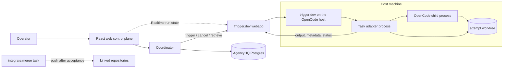

# Architecture

## Context

AgencyHQ is a modular monolith (web control plane plus coordinator) that
records intent, authority, evidence, and acceptance in Postgres and delegates
all execution to self-hosted Trigger.dev. Every unit of work — a Lead decision,
a worker attempt, a verification run, an integration — is a Trigger run. The
coordinator decides *whether* and *within what bounds* work runs and *whether
its evidence satisfies acceptance*; Trigger decides *how* it runs and *whether
it is still running*.

Slices 1–3 use the **host runtime profile** (ADR-0005): `trigger dev` on the
machine where OpenCode is configured, real Git worktrees per attempt. The
**container profile** is the later hardening path.

Arrows are commands and observations. Authority lives where the table in the
[README](../../README.md) says it does.

## Components

### Web control plane

React/TypeScript. Renders coordinator state and submits typed commands. For
live execution state it subscribes to Trigger runs by tag with Trigger's React
hooks using scoped public access tokens. Contains no scheduling or acceptance
logic. Runs in the same Node process as the coordinator.

### Coordinator

Owns the ledger and the policy:

- validates every transition against domain invariants and the project's
  [delegated-authority schema](adrs/0006-lead-role-and-delegated-authority.md);
- records a DispatchIntent before triggering any task and uses the intent id
  as the Trigger idempotency key;
- consumes run outputs and final statuses idempotently into attempt reports,
  Artifacts, VerificationResults, Reviews, and failure records;
- commits Lead proposals as Decisions only when they pass the authority check;
- holds the Trigger secret key and AgencyHQ's own secrets.

### Lead

The engineering decision role (ADR-0006): OpenCode sessions in a read-only
agent configuration returning structured JSON, run as Trigger tasks in a
read-only worktree at the relevant revision. Proposes definitions of done,
verification profiles, review depth, boundaries, Finding dispositions, failure
classifications, review findings, and acceptance. Proposals become Decisions
only through the coordinator.

**Mechanism (Slice 3, 2026-09-07).** Lead tasks (`lead.plan`, `lead.review`, `lead.accept`) use the OpenCode SDK: `opencode serve --port 0` is spawned with a read-only permission ruleset, a single prompt is sent with `format: { type: "json_schema" }`, and the `StructuredOutput` tool is allowed so the JSON loop completes. The structured output is validated by `LeadPlanOutputSchema` / `ReviewOutput` / `AcceptanceProposal` before the coordinator records any Decision. The project's **verification profile catalog is an authority ceiling**: the Lead may only choose a `profileId` that appears in the project's catalog; a proposal naming an unknown profile is recorded as `pending_human` with `PROFILE_NOT_IN_CATALOG` and is not retried automatically. This was observed in the Slice 3 trial; see [trials/2026-09-slice3.md](trials/2026-09-slice3.md).

### Trigger.dev (execution runtime)

Self-hosted v4 webapp stack (ADR-0005) plus, on the host profile, `trigger dev`
running on the OpenCode host. Provides queues and per-repository
serialization, attempts and retries, `maxDuration`, cancellation with bounded
grace, idempotent dispatch, tags, metadata, run output, Realtime, and the
raw-log dashboard. Run status is trusted for execution mechanics and never for
acceptance. The container profile adds the supervisor/worker stack.

### Task adapters (`trigger/`)

Thin, versioned task definitions with no policy:

| Task | Does | Returns as run output |
| --- | --- | --- |
| `lead.plan` | Read-only OpenCode session in a worktree at the base revision; proposes StepContract, criteria, profile, review depth, boundary. | Structured proposal with source citations. |
| `worker.attempt` | `git worktree add` at the base revision; resolves the model from `payload.model` then `AGENCYHQ_OPENCODE_MODEL` — neither being set is a setup failure (`AbortTaskRunError`, not retried); requires `permissionRules` in the payload — resolves with `resolveWorkerRuleset` (contract ruleset with always-deny set enforced on top) and fails setup with `AbortTaskRunError` if absent; spawn OpenCode with scrubbed env; on exit diff, path-check (`paths.deny` from the payload enforced in classification — violations quarantine), commit `agencyhq/attempts/<id>`; on cancel commit a checkpoint and kill the process group. | Worker report, commit id, diff digest, path violations. |
| `verify.run` | Separate worktree at the attempt revision; run the approved profile's checks; `protectedPaths` from the payload (package manifests, lock files, workspace file, tsconfig*, biome.json, .github/**, vitest/jest configs; test source files are not protected) detect verifier tampering and produce blocking `verifier_tampered` findings; records `protectedPathsSource` (`"payload"` when the coordinator sent the field, `"default"` otherwise) in the `integrity` output field. The coordinator's `onVerifyFinal` unions the adapter's `integrity.tamperedPaths` set with its own recomputed set, records both sides as JSON (`{ adapter, coordinator, protectedPathsSource }`) in finding evidence, and logs disagreement; `onAcceptFinal` loads blocking `verifier_tampered` findings and rejects with `VERIFIER_TAMPERED`. Covered by `apps/coordinator/test/integration/flow.integrity.test.ts` (three tests: adapter agrees, adapter omits, union case) and `trigger/test/verify-run-core.test.ts` (H-6: `protectedPathsSource` in output). Capture bounded logs. | VerificationResult records plus `integrity` field. |
| `lead.review` | Read-only session over the diff and evidence; adversarial review. Reviewer identity is the invoked `payload.model`. | Review findings against exact versions. |
| `lead.accept` | Judges criteria against evidence and review; coordinator's `evaluateAcceptance` reads `integrityFindings` from the attempt's `findings` table and rejects with `VERIFIER_TAMPERED` (one of 14 acceptance reason codes) when any blocking integrity finding is present. | Acceptance proposal with rationale. |
| `integrate.merge` | After a recorded acceptance: merge to the target ref, compare-and-set on expected base, push with host credentials. | Resulting revision or conflict evidence. |

Adapters raise `AbortTaskRunError` for contract failures so Trigger does not
retry work that a decision must follow.

### OpenCode

The coding-agent runtime and provider abstraction, configured and
authenticated on the host. AgencyHQ invokes it non-interactively
(`opencode run --format json --dir <worktree>` with an agent and permission
rules per contract) and reads its JSON event stream and structured outputs.
AgencyHQ implements no agent loop and no provider adapters.

### Git and repositories

Git is source truth. Each Project has a coordinator-owned clone; each attempt
gets its own worktree folder, never reused. Adapters, not workers, commit
attempt and checkpoint branches locally. Only `integrate.merge` pushes.
Postgres stores commit ids and digests, never source.

## Enforcement boundaries

Host profile as declared. A contract that requires a boundary the profile
marks advisory is rejected at dispatch. A spend estimate is advisory on the
host profile and does not cause R-016 rejection; only contracts that enable
`webfetch` or `websearch` tools additionally require `fs_isolation` and
`egress_spend` to be enforceable (`packages/domain/src/authority/runtime.ts`).

| Boundary | Host profile | Kind | Container profile |
| --- | --- | --- | --- |
| Worktree per attempt | Separate `git worktree` folder; never shared with a replacement. | Before action | Fresh clone per container. |
| Filesystem isolation from the host | None; the worker can read host files. | Advisory | Container filesystem. |
| CPU, memory | None. | Advisory | Machine preset. |
| Duration | Trigger `maxDuration` from the contract. | Before action | Same. |
| Tool and command capability | OpenCode permission rules generated from the contract; `deny` survives `--auto`. | Before action | Same. |
| Output paths | Adapter diff check against `paths.allow/deny`; violations quarantine the attempt. | On output | Same. |
| Git pushes from the worker | Scrubbed child environment (no SSH agent, no tokens, empty credential helper) plus `deny` on `git push`/`git remote`. | Before action | No credential exists. |
| Merge, deploy, publish | Only `integrate.merge`, after acceptance, serialized, compare-and-set. | Before action | Same, with operation-scoped token. |
| Termination | Generation revoked → `runs.cancel` → `onCancel` checkpoint commit and process-group kill → adapter confirms no survivors → Trigger final status. | Trusted observation | Supervisor removes the container. |
| Egress and provider spend | None; spend is an estimate. | Advisory | Gateway with per-attempt keys (later). |
| Nested agents | OpenCode `task` tool denied for worker agents. | Before action | Same. |

## Dependency rule

`packages/domain` imports nothing from Trigger, OpenCode, React, or Postgres
clients. `trigger/` and `packages/db` depend on `packages/contracts` and
`packages/domain`. The coordinator composes them. This is verified by
`tests/dependency-rules.test.mjs` (6 cases), which runs as part of `pnpm check`.

## Deployment shape

Host profile: one AgencyHQ process (web + coordinator), one AgencyHQ Postgres,
the Trigger webapp stack (webapp, Postgres, Redis, Electric, ClickHouse, S2
realtime streams, registry, object storage), and `trigger dev` kept running on
the OpenCode host. The Docker socket proxy belongs to the worker stack and is
not deployed on the host profile. No worker machine. AgencyHQ and Trigger never
share a database or credentials; AgencyHQ uses only Trigger's SDK and
management API. On the host profile, the Trigger API reports a final run status
before the adapter finishes cleanup; confirmation comes from the adapter's stop
record on disk (`<runDir>/stop.ndjson`), not from run status alone — see the
[Slice 1 execution trial](trials/2026-09-slice1.md).

## Security baseline

- The coordinator holds AgencyHQ secrets and the Trigger secret key. Worker
  processes inherit the host's OpenCode credentials by design of the host
  profile; that exposure is recorded, not hidden.
- The coordinator HTTP API binds to `AGENCYHQ_BIND_HOST` (default
  `127.0.0.1`). All `/api/*` routes except `/api/health` require an
  `Authorization: Bearer <token>` header matching `AGENCYHQ_API_TOKEN`. When
  `AGENCYHQ_API_TOKEN` is unset and the bind host is not loopback, the server
  fails closed at startup. Loopback without a token is allowed but logs a
  startup warning. The web client stores the token in
  `localStorage["agencyhq.apiToken"]`, includes `Authorization: Bearer
  <token>` on every `/api/*` call, and shows a token-entry form when the API
  returns 401.
- Every command is bound to actor, Project, contract version, attempt, and
  generation; Decisions and Approvals are immutable audit records.
- Worker reports, repository content, Lead proposals, and run outputs are
  untrusted input; deterministic checks and the authority schema bound them.
- Operator sessions are authenticated even for one operator; Trigger public
  access tokens for the UI are scoped to specific runs or tags.

See [DOMAIN_MODEL.md](DOMAIN_MODEL.md), [EXECUTION_MODEL.md](EXECUTION_MODEL.md),
and ADRs [0001](adrs/0001-authority-boundaries.md), [0002](adrs/0002-modular-monolith.md),
[0005](adrs/0005-trigger-as-execution-runtime.md), [0006](adrs/0006-lead-role-and-delegated-authority.md),
[0007](adrs/0007-worker-effect-model.md).
